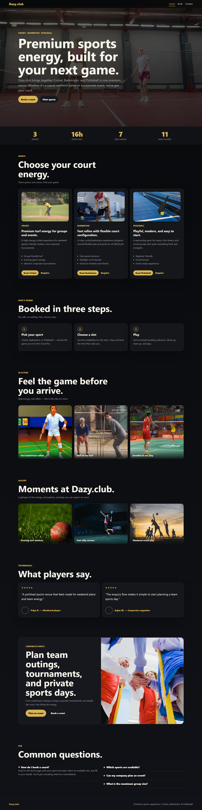

# Dazy.club

**Dazy.club** is a premium sports-venue platform for Cricket, Badminton, and Pickleball. What began as a public marketing site is now a full operating system for the venue: a **public booking website**, a **staff admin back-office**, a **cafe POS + kitchen-display kiosk** with GST-compliant billing, and a **FastAPI backend** that powers all three.

| App | Path | Port | Who uses it |
|-----|------|------|-------------|
| 🌐 Web | `apps/web` | 5173 | Customers — browse sports, book a slot, send enquiries |
| 🛠️ Admin | `apps/admin` | 5174 | Staff/managers — bookings, schedule, content, cafe menu, orders |
| 🍽️ Kiosk | `apps/kiosk` | 5175 | Cashiers/kitchen — POS billing, order history, tables, KDS |
| ⚙️ API | `apps/api` | 8000 | FastAPI backend serving all of the above |



---

## Tech Stack

**Frontends** (all three): React 18 · TypeScript · Vite · React Router · plain CSS (dark, gold-accent theme).

**Backend**: FastAPI · Python 3.12 · Pydantic v2 · SQLAlchemy 2.0 (sync) · Alembic migrations · SQLite (swappable to PostgreSQL via `DAZY_DB_URL` with zero repo changes) · JWT auth (admin password + cashier PIN).

**Monorepo**: pnpm workspaces. Shared code in `packages/shared` (data/contracts) and `packages/ui` (primitives).

**Testing**: pytest (backend) + Playwright (E2E across web/admin/kiosk).

> **Note:** The backend is **FastAPI/Python**, not .NET. Earlier docs referenced an ASP.NET shell that was never built — the project standardized on FastAPI per [ADR-011](docs/adr/ADR-011-Backend-FastAPI.md).

---

## Features at a glance

- **Public booking** — pick sport → date → live availability slots → multi-slot booking with party size, price, and promo codes.
- **Enquiries** — general contact + corporate/event capture.
- **Admin back-office** — bookings management, data-driven scheduling (weekly rules + venue-wide/per-court holiday exceptions), courts, promos, CMS content, gallery (with image upload), testimonials, users/roles, enquiry triage.
- **Cafe POS (kiosk)** — cashier PIN login, menu + cart, order placement, cash/UPI/card payments with round-off disclosure, **GST invoices** (CGST/SGST split, financial-year invoice numbering, amount-in-words, 80mm thermal print), order history, table status.
- **Kitchen Display System (KDS)** — KOTs routed by station (kitchen/bar), live polling, mark preparing/ready.

Full catalog with screenshots: **[docs/Features.md](docs/Features.md)**. API reference: **[docs/API-Reference.md](docs/API-Reference.md)**.

---

## Repo Layout

```
apps/
  web/      React public website (booking + enquiry)
  admin/    React staff back-office (17 pages)
  kiosk/    React cafe POS + KDS (5 pages)
  api/      FastAPI backend (routes/, repositories/, services/, alembic/)
packages/
  shared/   Shared data & contracts
  ui/       Shared UI primitives
e2e/        Playwright specs (web / admin / kiosk) + E2E-BIBLE.md
docs/       Source of truth — features, ADRs, architecture, screenshots
infra/      Local infrastructure notes
```

---

## Getting Started

Prerequisites: **Node 18+**, **pnpm**, **Python 3.12**, and [**uv**](https://github.com/astral-sh/uv) (or a venv) for the API.

```bash
# 1. Install JS deps
pnpm install

# 2. Backend (from apps/api) — creates SQLite DB, runs Alembic migrations, seeds demo data on first boot
cd apps/api
uv run uvicorn main:app --reload --port 8000
#   …or with a venv:
#   .venv/Scripts/python -m uvicorn main:app --reload --port 8000

# 3. Frontends (from repo root, separate terminals)
pnpm dev:web      # http://localhost:5173
pnpm dev:admin    # http://localhost:5174
pnpm --filter @dazy/kiosk dev   # http://localhost:5175
```

The API auto-migrates to head and seeds gallery/testimonials/CMS/venue/courts/schedule/promos on an empty DB.

### Default credentials (dev)

| App | Login |
|-----|-------|
| Admin | username `admin` / password `admin` (override via `ADMIN_USERNAME` / `ADMIN_PASSWORD`) |
| Kiosk | a **cashier** user (create one in Admin → Users) — login with staff name + 4-digit PIN |

---

## Useful Commands

```bash
pnpm dev:web | pnpm dev:admin        # run a frontend
pnpm build                           # build all
pnpm typecheck                       # TS typecheck

# Backend tests (from apps/api)
.venv/Scripts/python -m pytest tests -q

# E2E (servers must be running, or Playwright starts them)
pnpm e2e                             # all projects
npx playwright test --project=admin  # one project
```

Regenerate documentation screenshots any time via the `zz-screenshots.spec.ts` specs under `e2e/{web,admin,kiosk}/`.

---

## Documentation

- **[docs/Features.md](docs/Features.md)** — every feature of every app, with screenshots.
- **[docs/API-Reference.md](docs/API-Reference.md)** — all REST endpoints, data model, migrations, business logic.
- **[docs/Roadmap.md](docs/Roadmap.md)** — gap analysis + planned enhancements (POS, BI, booking, security). Not yet built.
- **[docs/architecture/](docs/architecture/)** — system, backend, deployment architecture.
- **[docs/adr/](docs/adr/)** — accepted architecture decisions.
- **[docs/Cafe-POS-Plan.md](docs/Cafe-POS-Plan.md)** — POS phased build plan.
- **[e2e/E2E-BIBLE.md](e2e/E2E-BIBLE.md)** — E2E testing conventions.
