# Dazy.club — Feature Catalog

Complete reference of every feature across the four apps, with screenshots. For the REST API and data model, see [API-Reference.md](API-Reference.md).

- [🌐 Web — Public Website](#-web--public-website)
- [🛠️ Admin — Back-Office](#-admin--back-office)
- [🍽️ Kiosk — Cafe POS & KDS](#-kiosk--cafe-pos--kds)
- [⚙️ Backend — Cross-Cutting](#-backend--cross-cutting)

---

## 🌐 Web — Public Website

Customer-facing site at **:5173**. Dark, gold-accent theme; fully responsive (desktop + mobile).

### Home

The landing page: hero with CMS-driven tagline/copy, the three sports, a live gallery, testimonials, and a venue stats band.

- **Hero** — tagline + body copy pulled from CMS (`hero_tagline`, `hero_copy`); call-to-action into booking.
- **Sports** — Cricket, Badminton, Pickleball cards.
- **Gallery** — driven live from the API (`GET /gallery`, approved items only), images render from uploaded/managed `imageUrl`.
- **Testimonials** — approved testimonials from the API.
- **Stats band** — 3 Sports · 16h Open daily · 7 Days ahead · 11 Max players. Count-agnostic centered layout with dividers (no hardcoded 4-column grid), so stats can be added/removed without lopsiding; wraps to 2×2 on mobile.
- **Footer** — venue name, tagline, contact, socials from CMS.

**Mobile:**

### Book

The booking flow: choose a sport, choose a date, see **live availability slots**, and book one or more slots.

- **Sport selector** — Cricket / Badminton / Pickleball.
- **Date picker** — bookable window (7 days ahead).
- **Live slots** — fetched from `GET /slots`; availability is computed from schedule rules, exceptions (holidays/special hours), capacity, and existing bookings. Closed days / blocked dates show no slots.
- **Multi-slot booking** — select consecutive slots; one is flagged primary.
- **Party size & price** — party size validated against the sport's max (Cricket 11, Pickleball 6, Badminton 4); price derives from per-sport base price.
- **Promo codes** — validated via `GET /promos/validate` before submission.
- **Booking submission** — `POST /bookings` returns a booking reference immediately; customer record is created/linked.

**Mobile:**

### Contact

General enquiry and corporate/event enquiry, each its own form.

| General | Corporate |
|---------|-----------|
|  |  |

- **General enquiry** — `POST /contact-enquiries`; name, contact, message.
- **Corporate/event enquiry** — `POST /corporate-enquiries`; captures event details for the team to follow up.
- **Venue details** — address, phone, email, hours from CMS (`venue_*` keys).
- Client-side validation with inline field errors; FastAPI 422 validation errors are surfaced legibly (array `detail` joined into a readable message).

---

## 🛠️ Admin — Back-Office

Staff console at **:5174**. JWT login (`admin`/`admin` in dev). Left sidebar groups **Venue/Booking**, **Content**, and **Cafe** sections. Destructive actions use an in-app confirm dialog (no native `window.confirm`).

### Login

Username + password → JWT stored client-side. Wrong credentials show an inline error. Logout clears the session.

### Dashboard

Landing overview of venue activity (bookings/enquiries at a glance).

### Bookings

- List all bookings (`GET /admin/bookings`).
- Update booking status (`PATCH /admin/bookings/{id}`) through the status lifecycle.
- Cancel/delete a booking (`DELETE`, confirm dialog).

### Schedule

Data-driven availability. Two views: **weekly rules** and **advanced** (date exceptions).

| Weekly rules | Advanced / exceptions |
|--------------|------------------------|
| 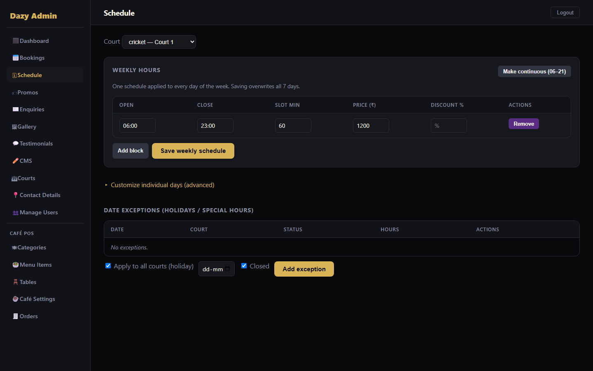 | 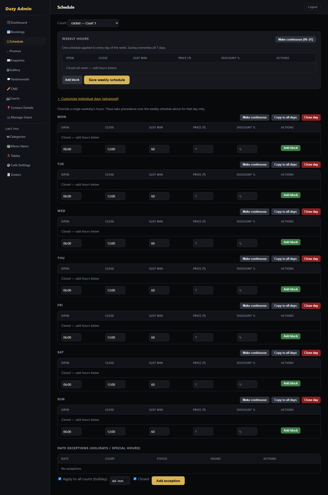 |

- **Weekly rules** — per-weekday open/close time blocks per court (`/admin/schedule/rules` CRUD). Helpers: "Make continuous", "Add block", "Copy to all days" (readable secondary-button styling).
- **Date exceptions** — close a day or set special hours for a specific date (`/admin/schedule/exceptions`). **"Apply to all courts" (holiday)** toggle, default on → a venue-wide exception (`court_id = null`) closes every sport that day; per-court exceptions are also supported. Venue-wide rows show "All courts".
- **Validation** — empty date is blocked with an inline "Date is required." error before submit.

### Courts

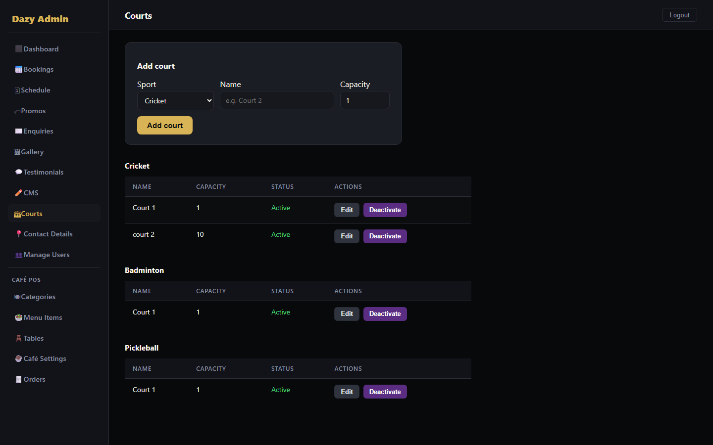

CRUD for courts (`/admin/courts`) — one court per sport seeded by default; capacity and active flags editable.

### Promos

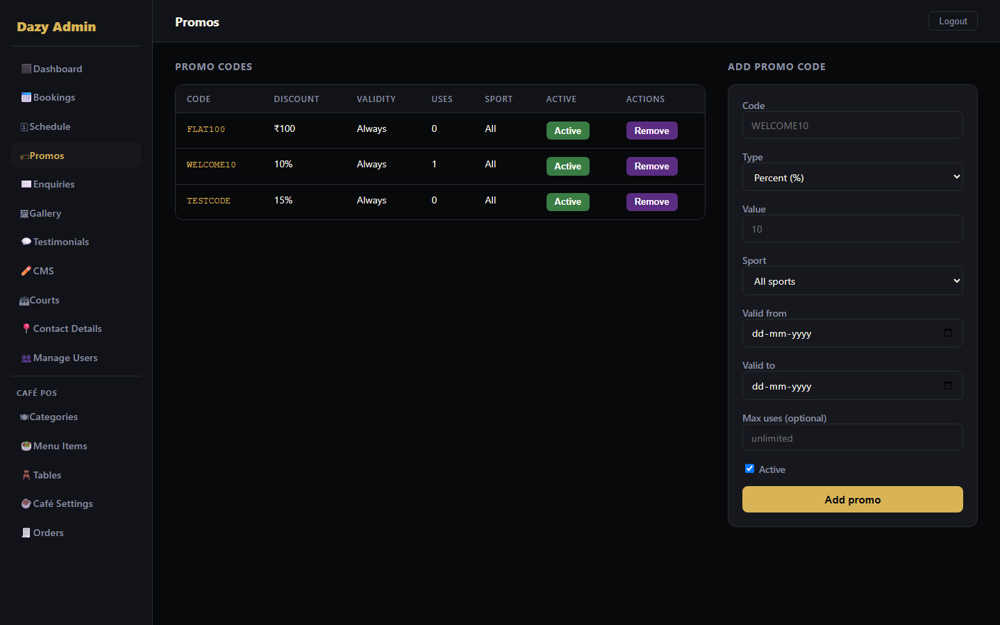

Promo-code CRUD (`/admin/promos`) — create/edit/remove discount codes used by the booking flow.

### Enquiries

Triage general + corporate enquiries (`GET /admin/enquiries`); update status (`PATCH`).

### Gallery

- Full CRUD (`/admin/gallery`) with **image upload** (`POST /admin/gallery/upload` → stored under `/media/gallery/...`) or pasted URL.
- Approve/reject controls; only approved items appear on the public site (realtime — public gallery reads the DB).
- Edit title/sport/tone; delete (confirm dialog) best-effort removes the local image file.

### Testimonials

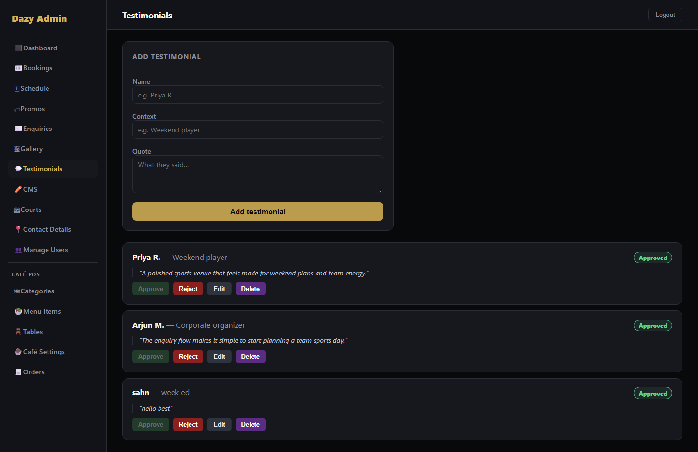

Full CRUD (`/admin/testimonials`) — add/edit/delete plus approve/reject. Approved items show on the public Home.

### CMS

Key/label/value content store (`/admin/cms`). Create new keys (409 on duplicate), edit label + value, delete. Drives hero copy, FAQs, footer, and venue contact details on the web site.

### Users

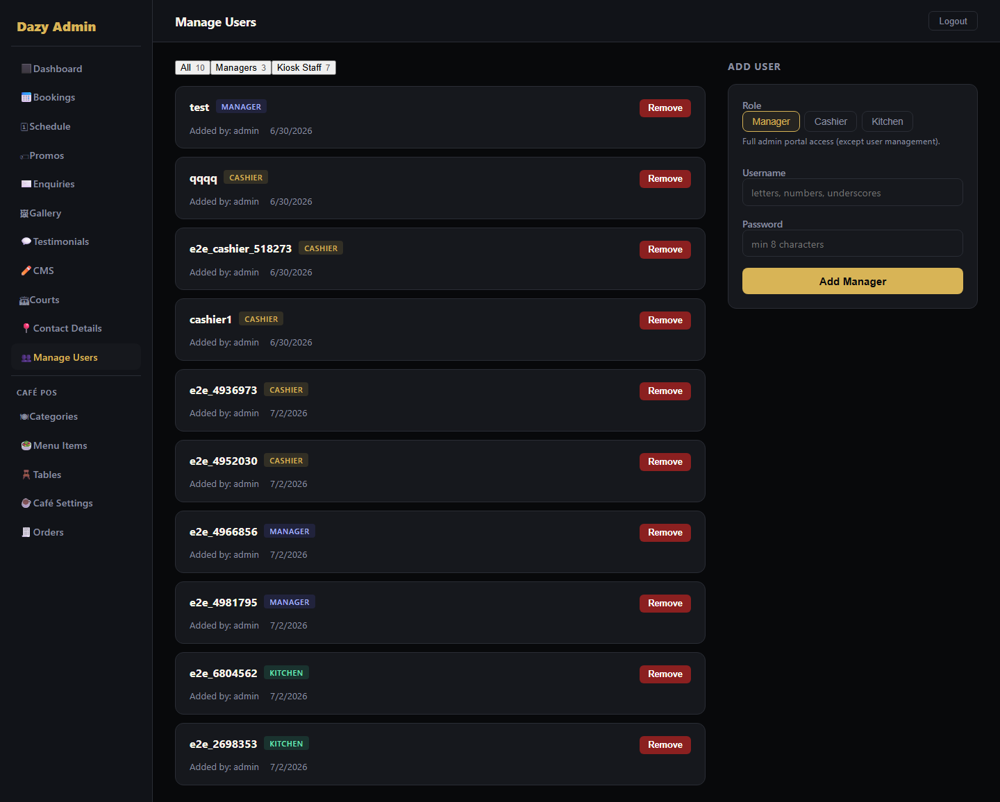

User/role management (`/admin/users`) — create admin/manager/cashier/kitchen users; cashier/kitchen accounts use a 4-digit PIN for kiosk login. Remove users (confirm dialog with the username).

### Contact Details

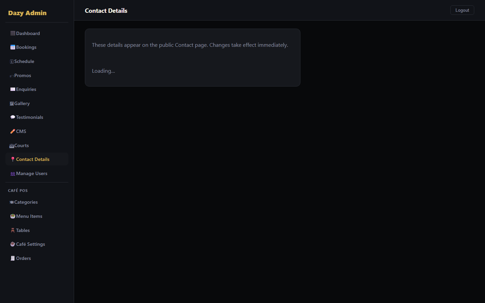

Edit the venue contact block (address, phone, email, hours, socials) surfaced on the public Contact page.

### Cafe — Menu Categories

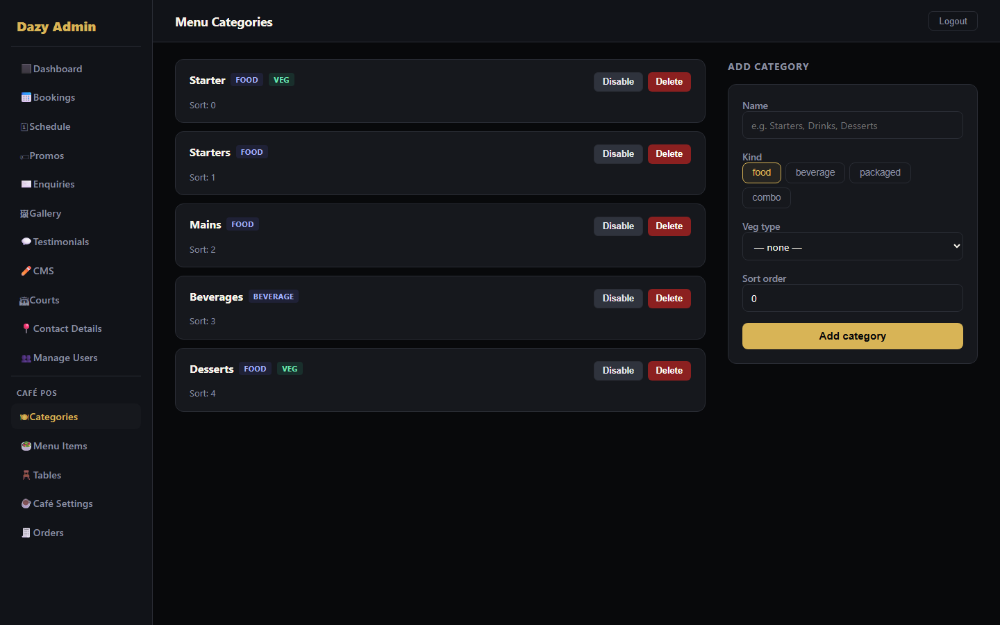

CRUD for menu categories (`/admin/cafe/categories`) — name, kind (food/beverage), veg type, sort order, active. Delete via confirm dialog.

### Cafe — Menu Items

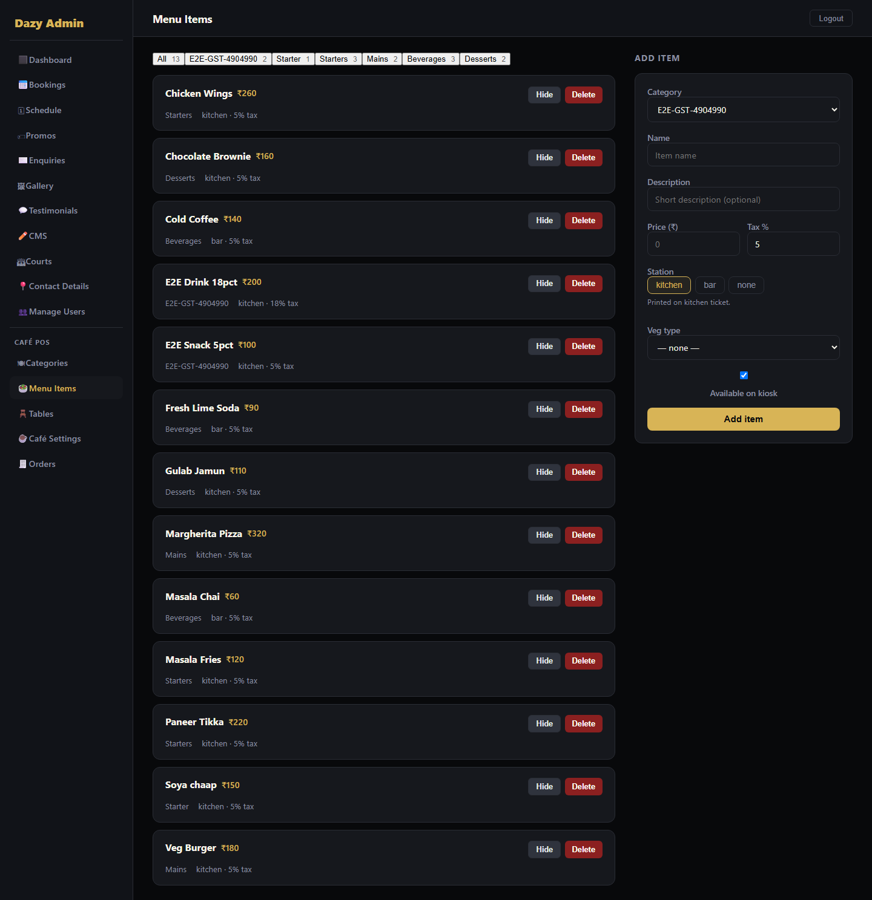

CRUD for menu items (`/admin/cafe/items`) — name, description, price, GST tax rate %, veg type, **station (kitchen/bar)** for KOT routing, packaged flag, availability, image, sort order.

### Cafe — Tables

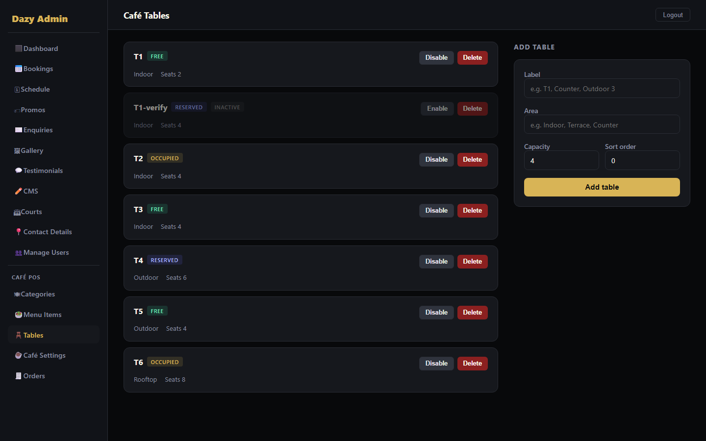

CRUD for dine-in tables (`/admin/cafe/tables`) — label, area, capacity, sort order, active, and **status (free/occupied/reserved)** editable from the edit form.

### Cafe — Settings

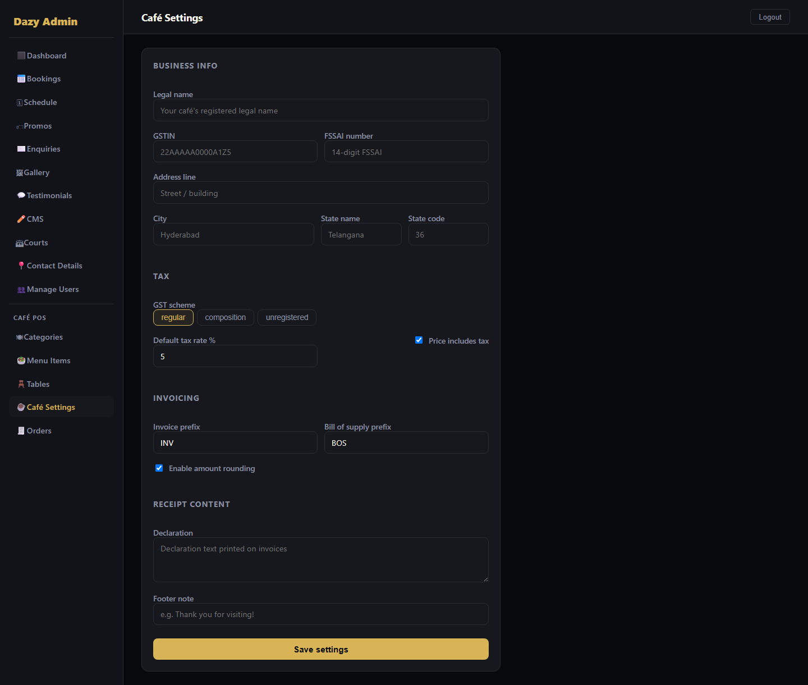

Cafe/GST configuration (`/admin/cafe/settings`) — business name, GSTIN, address, tax mode, invoice series, etc. — feeds the GST invoice generator.

### Cafe — Orders (read-only)

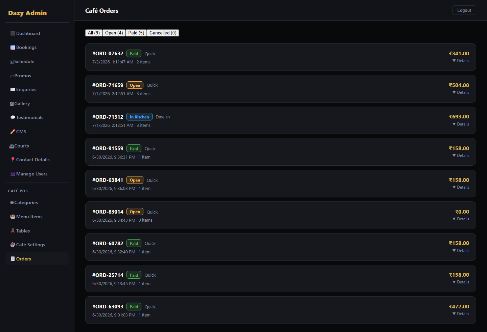

Back-office view of all POS orders (`/cafe/orders`). Filter tabs (All / Open / Paid / Cancelled) with counts; status badges; expand a row to see items + payments.

---

## 🍽️ Kiosk — Cafe POS & KDS

Touch-first POS at **:5175**. Cashier logs in with staff name + 4-digit PIN. Top nav: **Menu · Orders · Tables · KDS**. Auth token in `localStorage` (`dazy_kiosk_token`).

### Login

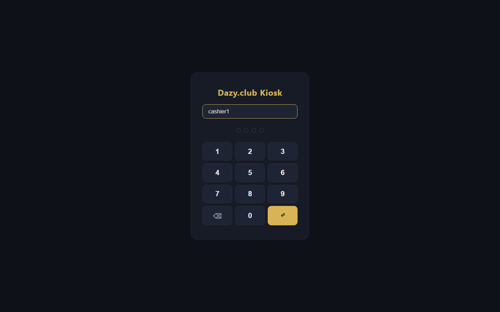

- Staff name + 4-digit PIN pad (digits, backspace, confirm). Keyboard entry also supported.
- Errors: invalid PIN, fewer than 4 digits, missing staff name.
- Already-authenticated cashiers are redirected straight to Menu; unauthenticated access to any page bounces to login.

### Menu (order building)

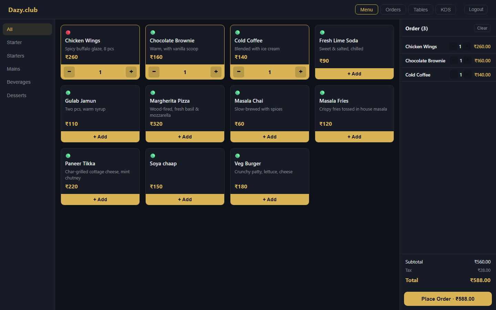

- **Category rail** + item grid; veg/non-veg/egg dots; price per item.
- **Cart panel** — add/remove with qty steppers; live **Subtotal / Tax / Total** (GST-inclusive math, 2-decimal amounts).
- **Place Order** → `POST /cafe/orders` (quick or dine-in) → opens the **Payment modal**.

**Payment flow (modal):**
- Mode: **Cash / UPI / Card**; UPI/Card show a reference field (correctly labelled per mode).
- **Round-off disclosure** — when server total differs from subtotal+tax, the round-off line is shown so the cashier sees the exact charge.
- `POST /cafe/orders/{id}/payments` records payment (auto-marks order paid when fully settled), then `POST /cafe/orders/{id}/invoice` issues a **GST invoice**.
- **Print Receipt** opens the 80mm thermal invoice (`GET /cafe/invoices/{id}/print`, public HTML that auto-triggers `window.print()`).
- Overlay click is blocked while a payment is processing.

### Orders (history & in-process)

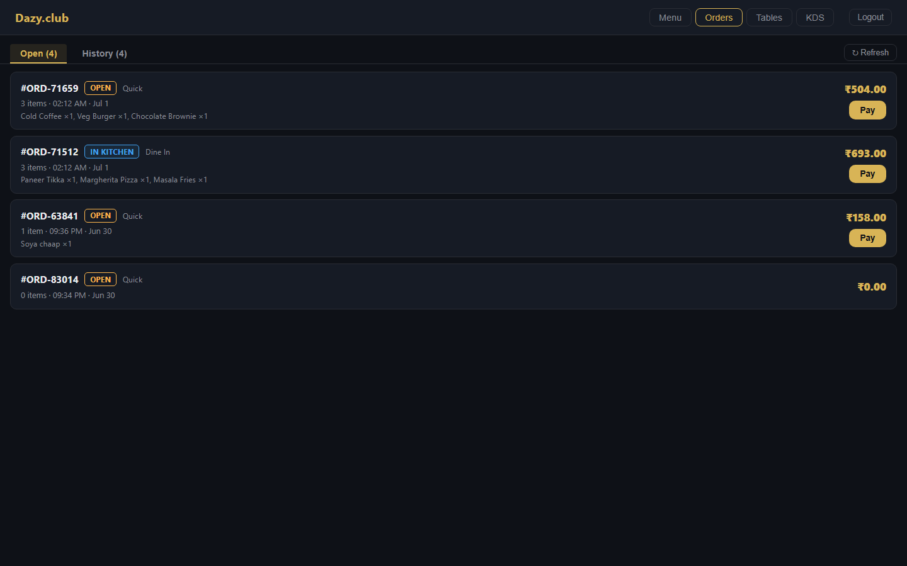

- **Open** tab — open/in-kitchen/served orders, each with a **Pay** action (guarded: only payable, non-zero, item-bearing orders).
- **History** tab — paid/cancelled orders, marked "✓ Settled".
- Auto-refreshes every 15s; manual refresh button.

### Tables

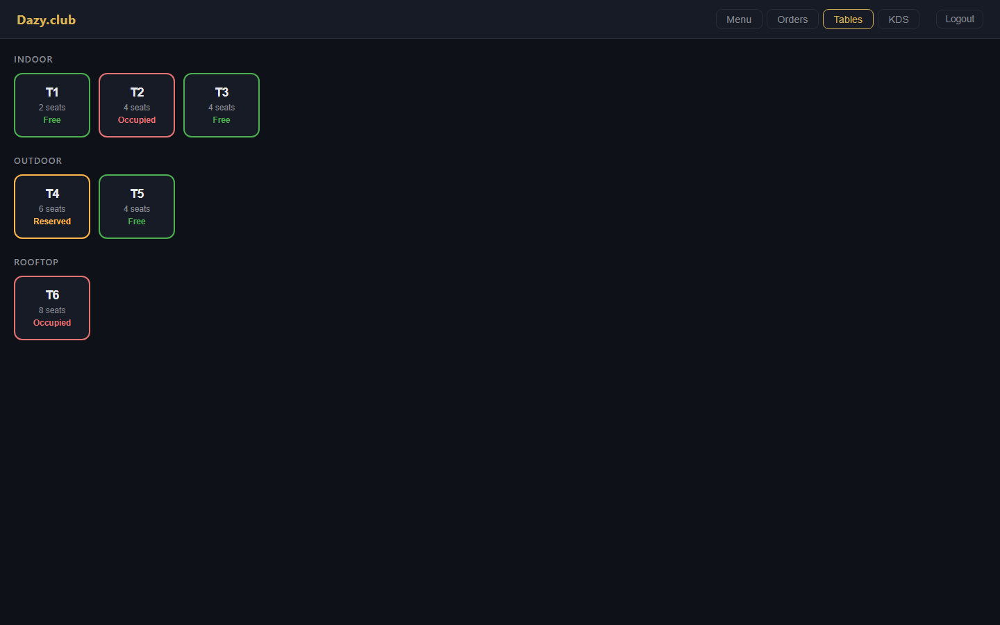

Floor view of tables with status; auto-refreshes every 30s. Logout clears the token.

### KDS — Kitchen Display System

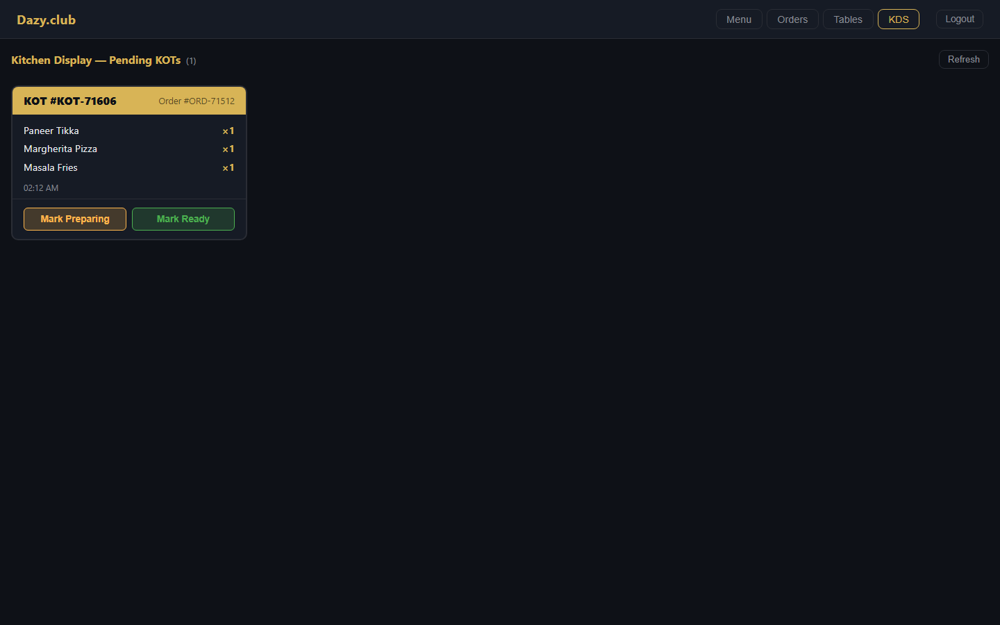

- Polls pending KOTs for a station (`GET /cafe/kots?station=kitchen&status=pending`) every 10s.
- Each KOT card shows its number, the source order number, and line items with quantities.
- **Mark Preparing** / **Mark Ready** (`PATCH /cafe/kots/{id}/status`); ready tickets drop off the board.

---

## ⚙️ Backend — Cross-Cutting

FastAPI at **:8000** (`/api/v1` prefix). Full endpoint list, data model, and migrations in [API-Reference.md](API-Reference.md). Highlights:

- **Auth & roles** — JWT. `get_current_admin` (password login) guards admin routes; `get_current_cashier` (accepts cashier/kitchen/manager/admin) guards cafe routes. Cashier PINs are 4-digit, bcrypt-hashed.
- **Scheduling engine** — availability computed from weekly **rules** + date **exceptions** (venue-wide or per-court), capacity, and existing bookings. Race-safe via a capacity-aware unique index.
- **GST billing** — invoices split CGST/SGST, number per **financial year** (e.g. `2526`) via an atomic sequence table, render **amount in words** (Indian numbering, no external deps), and print as 80mm thermal HTML.
- **KOT routing** — on "fire KOT", pending order items are grouped by **station** into one KOT per station.
- **Persistence** — SQLAlchemy 2.0 (sync) over SQLite; one `with _session()` context per repo op (auto commit/rollback). Swappable to PostgreSQL via `DAZY_DB_URL`. Schema managed by Alembic (auto-upgrades to head on boot); demo data seeded into empty tables.
- **Content** — gallery/testimonials/CMS are DB-driven and surface to the public site in realtime; uploaded images served from `/media`.
