# Dazy.club — Session Extract & System Snapshot

> Generated 2026-06-29. Single-file handoff: what was built this session + full system overview.

---

## Part A — Work / Decision Chronicle (this session)

Chronological digest of requests and what was done.

1. **Backend migration .NET → FastAPI.** Dropped ASP.NET Core 9 (`global.json`, `apps/api/Dazy.Api/` removed). Rebuilt API in FastAPI (Python 3.12, `uv` package manager). 16 docs updated; ADR-011 written (supersedes ADR-004).

2. **Public site cleanup.** Removed dev/dummy copy ("Live booking, OTP… coming next"), tidied testimonials/sports copy.

3. **Individual booking + slot availability.** Added `GET /slots` (12 slots/day × 7 days × 3 sports) and `POST /bookings` with slot grid UI (sport tabs, date pills, slot chips).

4. **Admin portal.** Full SPA (React + react-router) on :5174 — Login (JWT), Dashboard, Bookings, Enquiries, Gallery, Testimonials, CMS. Backend: repository pattern (`BaseRepository[T]` + `InMemory*`), JWT auth (`pyjwt`), env-var admin creds.

5. **Manager accounts + RBAC.** `UserRecord` + `SqliteUserRepository`; `POST/GET/PATCH/DELETE /admin/users` (superadmin-only via `require_superadmin`). Two roles in JWT: `admin` (env-var superadmin, full access incl. user mgmt) and `manager` (everything except `/admin/users`). bcrypt-hashed passwords.

6. **Test suite.** `pytest` + Starlette `TestClient`. 70 functional tests, then +57 negative/edge → **127 tests**, all passing. (`apps/api/tests/`.)

7. **SQLite persistence (SQLAlchemy ORM).** Swapped in-memory repos for `Sqlite*` repos writing to `apps/api/dazy.db`. Repo methods convert ORM row → Pydantic so route handlers unchanged. Slot availability **derived** from bookings table (no `SLOTS` mutation). DB swap to PostgreSQL = change `DAZY_DB_URL`. Verified: booking survives server restart.

8. **Single-command run.** Root `pnpm dev` runs API + web + admin concurrently (`concurrently`). Fixed broken `pnpm-workspace.yaml`.

9. **Bug fixes from QA:**
   - Slots now refresh after booking (no manual reload).
   - Past time-slots filtered out for today (backend `slots.py` + `bookings.py` guard).
   - **Contact/Corporate forms were fake** → wired to real API endpoints; persist to DB.
   - Preferred-sport → dropdown; preferred-date → `type=date` min-today.
   - Multi-page restructure: `/` (marketing), `/book`, `/contact` (General | Corporate tabs).

10. **Removed dummy pre-booked slots.** Emptied `_BOOKED` seed dict; wiped test data from `dazy.db`. Availability now 100% real.

11. **Real assets.** Pexels images (hero, 3 sports, 3 gallery, corporate, 2 avatars) + hero `.mp4` + 3 Giphy player GIFs, self-hosted in `apps/web/public/images/`. Favicon SVG + OG/Twitter meta + og-image. Later swapped badminton/gallery images + football→cricket GIF per feedback; corporate band → text-left/image-right split; FAQ → full-width 2-col.

12. **Full QA pass** (desktop + mobile 375px): every section, link, button, form, route tested. Found + fixed one real bug (forms `event.currentTarget.reset()` after `await` → false error). All else passed.

13. **Layout discrepancy audit (multi-agent workflow).** Found 12 ranked issues; fixed 11:
    - Sports cards: buttons now bottom-anchored on one baseline; tagline/description heights reserved (full mid-content alignment).
    - Slot chips: equal height (min-height + flex center).
    - FAQ: CSS `column-count` masonry, 1-col on mobile.
    - Testimonials: author row anchored.
    - 3-item grids: clean 3→1 collapse (no orphan-beside-empty-cell at tablet).
    - Contact tabs: removed inline-margin drift.
    - **Admin (broken):** logout button class mismatch (`logout-btn`→`btn-logout`), mobile sidebar collapse (`.sidebar-nav { display:contents }`), global `box-sizing:border-box`, gallery card actions anchored, dashboard stats `auto-fill`→`auto-fit`.
    - Deferred: design-system token unification (radii/min-heights) — cosmetic polish.

---

## Part B — System Snapshot

### Stack
| Layer | Tech |
|---|---|
| API | FastAPI (Python 3.12), Pydantic v2, uvicorn, SQLAlchemy 2 + SQLite, pyjwt, bcrypt |
| Web (public) | React 19 + Vite + TypeScript + react-router-dom v7 |
| Admin | React 19 + Vite + TypeScript + react-router-dom v7 |
| Monorepo | pnpm workspace; Python via `uv` |

### Run
```
pnpm setup     # first time: pnpm install --ignore-scripts + uv sync
pnpm dev       # API :8000 + web :5173 + admin :5174 (concurrently, one window)
pnpm api:test  # 127 pytest tests
```
Single commands: `pnpm dev:api` / `dev:web` / `dev:admin`. Stop with Ctrl+C in the `pnpm dev` window (clean tree).

### Ports
- Public site → http://localhost:5173
- Admin → http://localhost:5174 (login `admin` / `admin`)
- API → http://localhost:8000 (Swagger `/docs`)

### Repo layout (source)
```
apps/
  api/
    main.py            # FastAPI app, CORS, GZip, lifespan(init_db+seed), routers @ /api/v1
    db.py              # SQLAlchemy engine/session, init_db, seed_if_empty, _cms_seed
    db_models.py       # 6 ORM tables (bookings/enquiries/gallery/testimonials/cms/users)
    models.py          # Pydantic DTOs + records
    auth.py            # JWT, bcrypt, get_current_admin, require_superadmin
    deps.py            # singleton Sqlite* repo instances (DB-swap point)
    seed.py            # SPORTS, GALLERY_ITEMS, TESTIMONIALS, NOTIFICATIONS, SLOTS gen
    repositories/      # base.py + booking/enquiry/gallery/testimonial/cms/user _repo.py
    routes/            # health, sports, gallery, testimonials, notifications, slots, bookings, enquiries
    routes/admin/      # auth, bookings, enquiries, gallery, testimonials, cms, users
    tests/             # conftest + 9 test files (127 tests)
    dazy.db            # SQLite (gitignored)
    pyproject.toml
  web/
    src/main.tsx       # BrowserRouter
    src/components/Layout.tsx
    src/pages/         # Home, Book, Contact
    src/lib/api.ts     # fetch helpers + endpoint constants
    src/styles.css
    public/images/     # photos, hero.mp4, GIFs, favicon.svg, og-image
  admin/
    src/main.tsx       # BrowserRouter + AuthGuard
    src/components/     # Sidebar, TopBar, AuthGuard, StatusBadge
    src/pages/          # Login, Dashboard, Bookings, Enquiries, Gallery, Testimonials, CMS, Users
    src/lib/            # auth.ts (localStorage token), api.ts (Bearer fetch)
    src/styles.css
packages/shared/        # shared TS types + seed data (launchSports, galleryItems, testimonials)
docs/                   # ADRs, Decision-Log, architecture, this extract
```

### API endpoints (`/api/v1`)
Public: `GET /health`, `/sports`, `/gallery`, `/testimonials`, `/notifications`, `/slots?sport=&date=`; `POST /bookings`, `/contact-enquiries`, `/corporate-enquiries`.
Admin (JWT): `POST /admin/login`; `GET/PATCH /admin/bookings`; `GET/PATCH /admin/enquiries`; `GET/POST/PATCH/DELETE /admin/gallery`; `GET/PATCH /admin/testimonials`; `GET/PUT /admin/cms`; `GET/POST/PATCH/DELETE /admin/users` (superadmin only).

### Auth model
- JWT (HS256, 8h), `JWT_SECRET` env. Payload `{sub, role}`.
- `role=admin`: env-var superadmin (`ADMIN_USERNAME`/`ADMIN_PASSWORD`), full access.
- `role=manager`: DB user (bcrypt), all admin sections except user management.
- `get_current_admin` (both roles) / `require_superadmin` (admin only) FastAPI deps.
- Known limitation: JWT stateless → deleted manager's token valid until expiry (no revocation list).

### Data / persistence
- SQLite file `apps/api/dazy.db` (gitignored). Swap to PostgreSQL via `DAZY_DB_URL` env + driver — zero handler changes (repo pattern).
- Seeded on startup if empty: gallery, testimonials, CMS (7 entries). Bookings/enquiries/users start empty.
- Slots generated in-memory (rolling 7 days); availability derived = not-past AND no booking row for that slotId. Cancelled bookings still block the slot (by design).

### Tests
`cd apps/api && pnpm api:test` (or `python -m uv run pytest tests/ -v`). 127 tests: auth, slots, bookings, enquiries, admin gallery/testimonials/cms/users, edge cases (JWT expiry/tamper, boundary values, RBAC, overflow). Isolated via temp-file SQLite DB in `conftest.py`.

### Responsive breakpoints (web)
- ≤1024px: 3-item grids (sports/steps/gallery/action) → 1-col; `.split`/`.corporate-band` → stacked.
- ≤720px: testimonials/FAQ → 1-col; stats 4→2; buttons full-width; header stacks.
- Admin ≤760px: sidebar → horizontal wrap.

### Env vars (`.env.example`)
```
ADMIN_USERNAME=admin
ADMIN_PASSWORD=admin
JWT_SECRET=change-this-to-a-long-random-string-in-production
# optional: DAZY_DB_URL=sqlite:///./dazy.db
VITE_API_BASE_URL=http://localhost:8000/api/v1   # apps/web/.env
```

### Known open items / notes
- Production deploy needs SPA fallback (rewrite all → index.html) for `/book`, `/contact` routes.
- GIFs are heavy (badminton2 ~5.5MB); could transcode to muted `<video>` loops (~10× smaller).
- Design-system tokens (control radii/min-heights) not yet unified — deferred polish.
- Port-killing leaves `--reload` zombies; prefer Ctrl+C in the dev window.

### Full raw transcript
This file is a digest. The complete machine transcript (every message + tool call) for this session is at:
`C:\Users\shaparashar\.claude\projects\C--Users-shaparashar-Documents-extra-personal-code-dazy-club-pilot\e6c268df-a4d5-40d8-8f9c-4617e4601406.jsonl`

---

## Part C — App Screenshots

Full-page captures (Playwright headless, Chromium). Desktop = 1366px, mobile = 390px. Admin tables show seeded demo data.

### Public Site — Home (`/`)

Marketing landing: hero with autoplay video background, stats band (3 sports · 12 slots/day · 7 days · 11 max), three sport cards with aligned CTA baselines, "Booked in three steps", animated player GIF strip ("In action"), gallery, testimonials with star ratings, corporate split band, and full-width 2-col FAQ.

### Public Site — Book a court (`/book`)
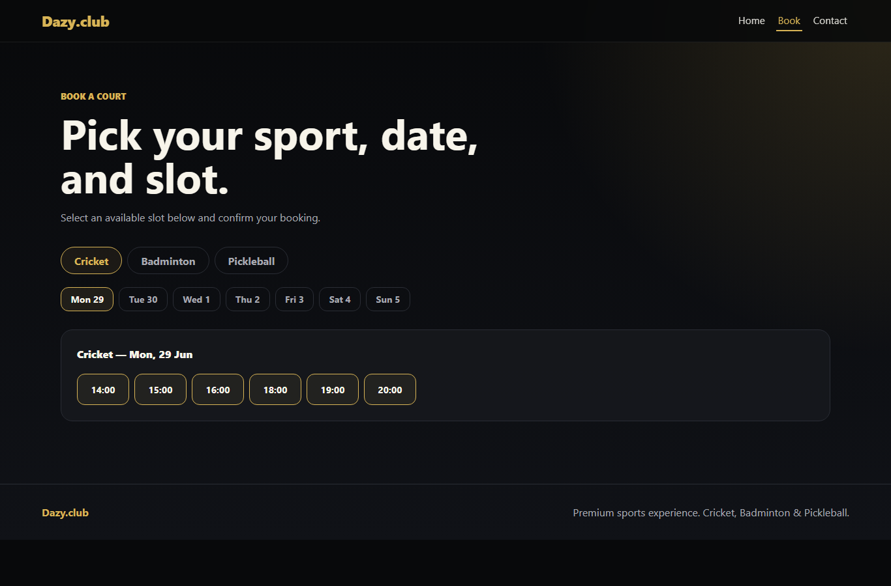
Focused booking flow: sport tabs (Cricket/Badminton/Pickleball), 7-day date pills, live slot-availability grid (past slots filtered, booked slots struck-through, equal-height chips). Selecting a slot reveals the booking form; on submit the grid refreshes and a reference is shown.

### Public Site — Contact: General enquiry (`/contact`)
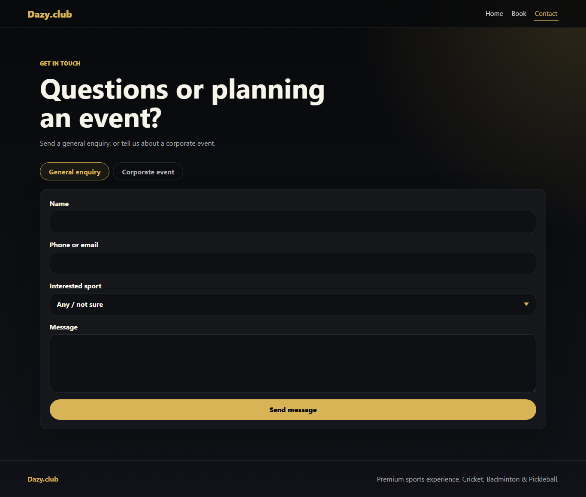
Tabbed "Get in touch" section. General enquiry form (name, contact, interested-sport dropdown, message) posting to `/contact-enquiries` and persisting to the database.

### Public Site — Contact: Corporate event (`/contact?tab=corporate`)
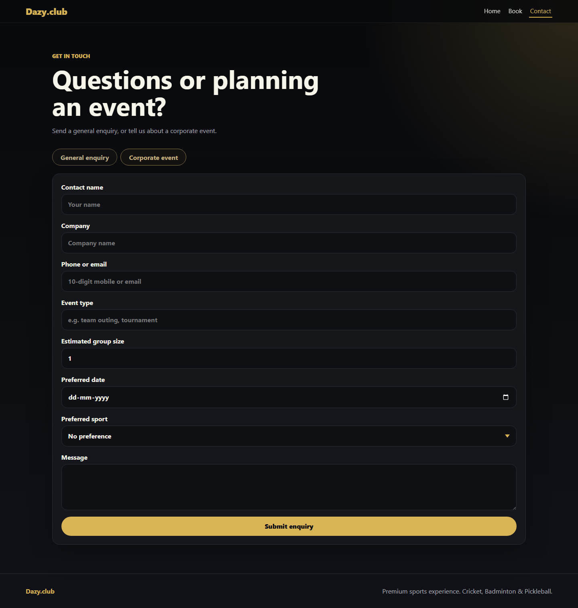
Corporate tab: contact name, company, group size, preferred date (min today), preferred-sport dropdown, message → `/corporate-enquiries`.

### Public Site — Home (mobile, 390px)
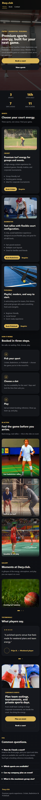
Responsive layout: nav stacks, hero scales, stats 2-col, all card grids collapse to 1-col, full-width buttons. No horizontal scroll.

### Public Site — Book (mobile, 390px)
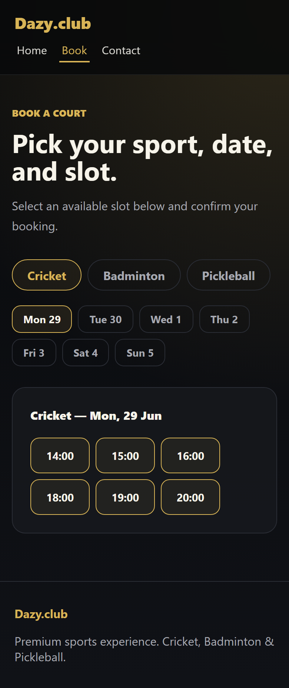
Sport tabs and date pills wrap; slot chips reflow to a compact grid; booking form full-width.

### Admin — Login (`/login`)
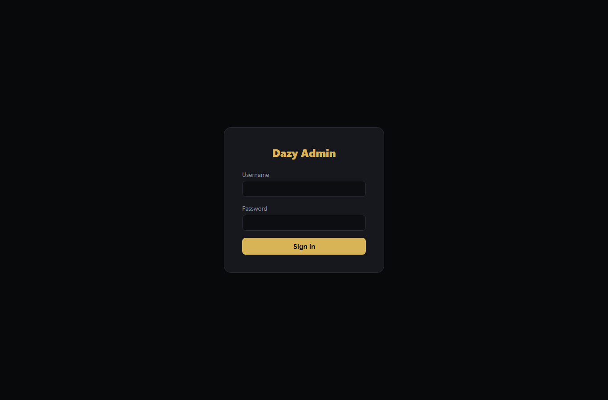
JWT login card. Credentials from env vars (`admin` / `admin` by default). Token stored in localStorage; `AuthGuard` redirects unauthenticated users here.

### Admin — Dashboard (`/`)
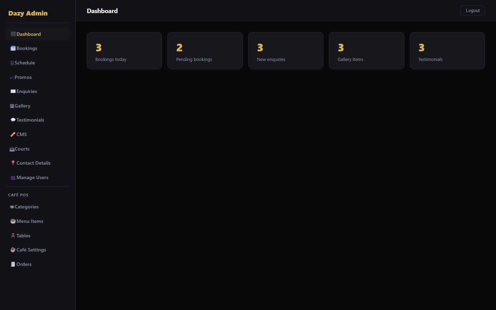
Summary stat cards (today's bookings, pending, new enquiries, gallery, testimonials) linking to each module. Styled sidebar nav + top bar with working Logout.

### Admin — Bookings (`/bookings`)
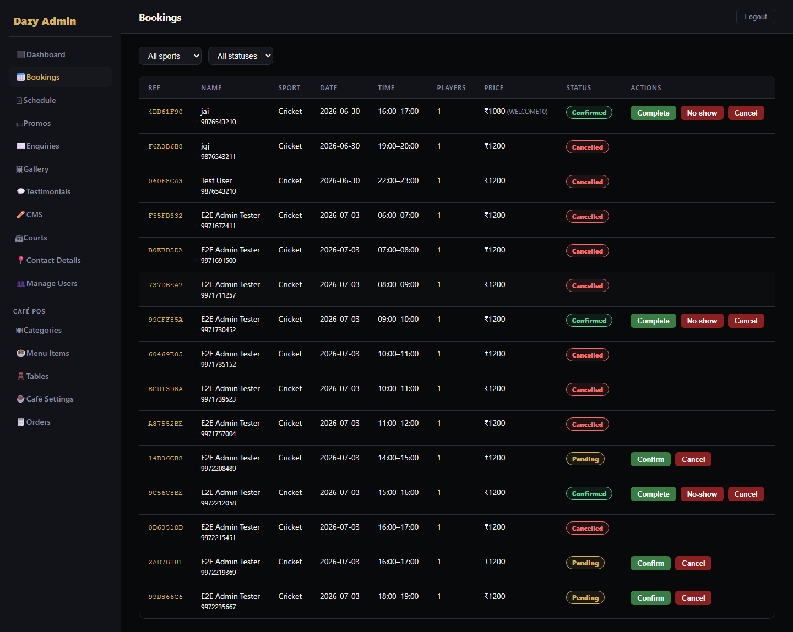
Filterable table (sport/status) of all bookings with reference, customer, slot, players, status badge, and Confirm/Cancel actions (PATCH status).

### Admin — Enquiries (`/enquiries`)
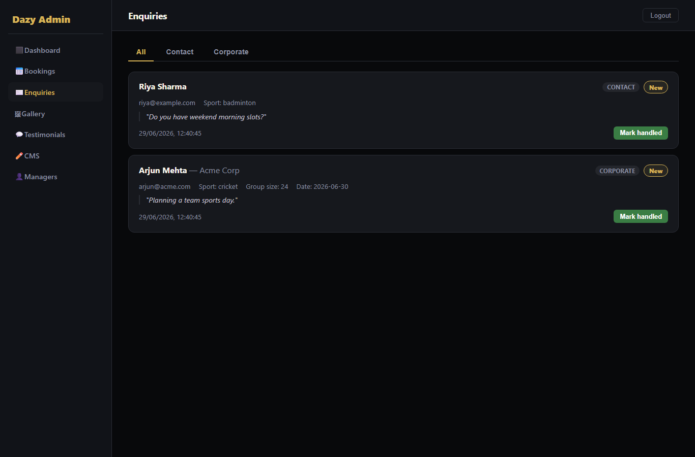
Contact + Corporate enquiries with type/status filter and "mark handled" action. Cards show all submitted fields.

### Admin — Gallery moderation (`/gallery`)
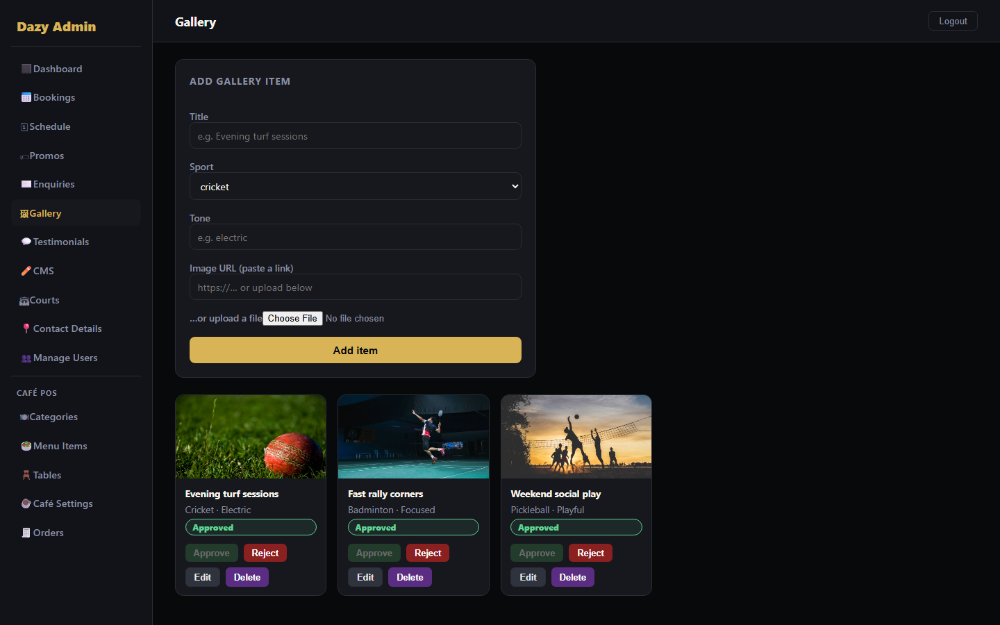
Grid of gallery items with Approve / Reject / Delete; equal-height cards with bottom-anchored action rows.

### Admin — CMS (`/cms`)
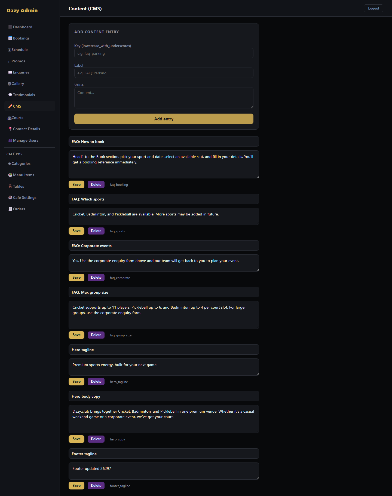
Editable site copy (FAQs, hero, footer) — edit value per key and save (PUT `/admin/cms/{key}`).

### Admin — Managers (`/users`)
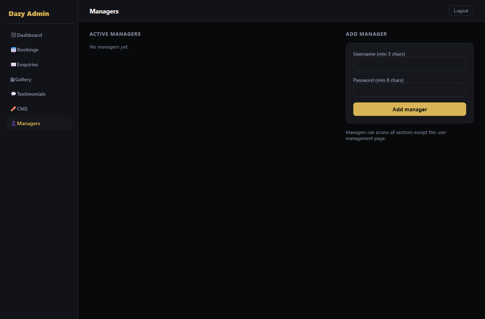
Superadmin-only. Create manager accounts (min 3-char username, 8-char password), list active managers, remove. Managers get all admin access except this page.
