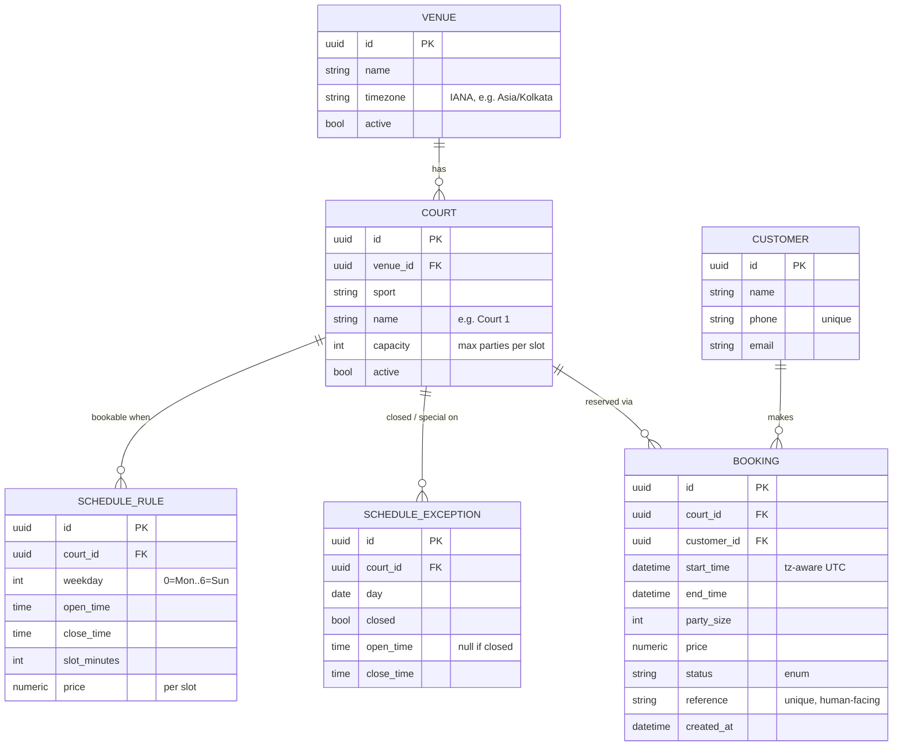
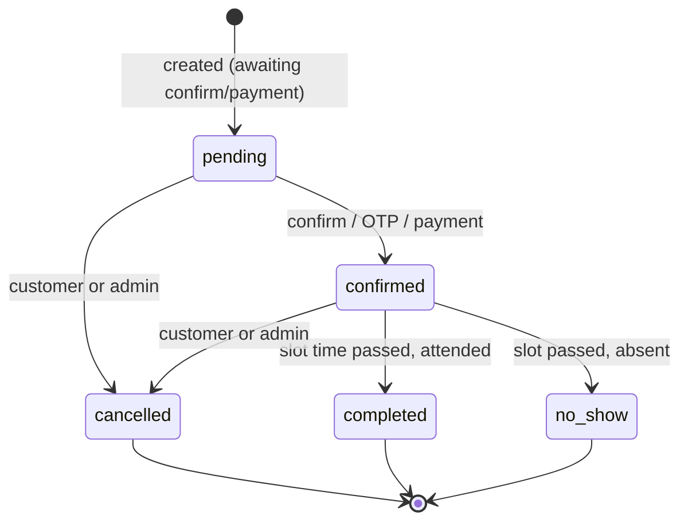
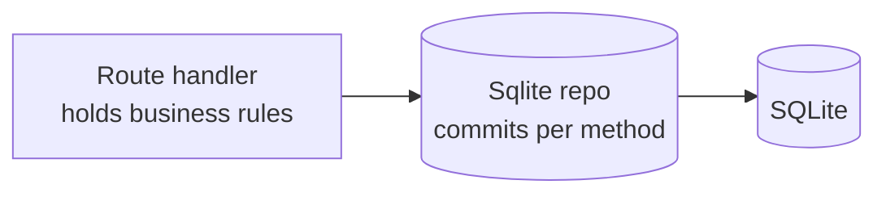
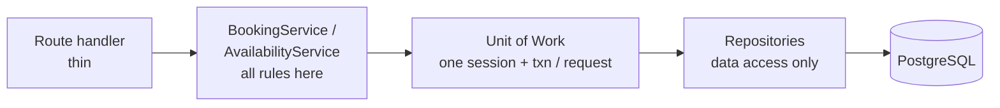
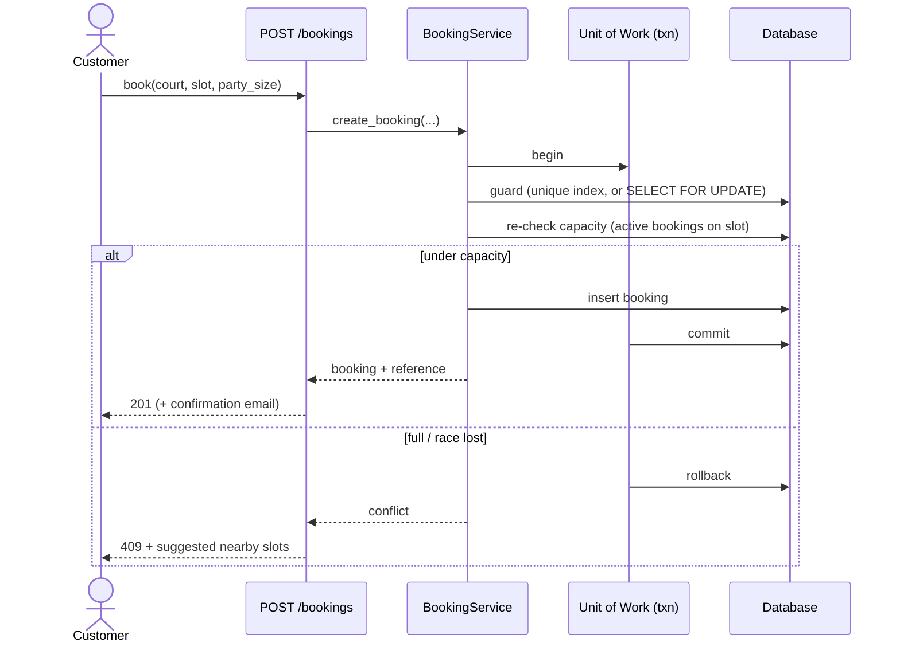

# ADR-012 — Resource-Scheduling Domain Model

- **Status:** Proposed
- **Date:** 2026-06-29
- **Relates to:** ADR-011 (FastAPI backend); builds on the SQLite + repository-pattern persistence decision.
- **Supersedes:** the implicit in-memory slot model (3 hardcoded sports × 12 generated slots/day). No prior ADR covered the domain model itself.
- **Adjust the number** to fit your sequence if 012 is taken.

---

## 1. Context

The pilot models bookings around an **ephemeral slot list**: three sports are hardcoded, twelve slots per day are generated in memory over a rolling 7 days, and availability is *derived* (a slot is open if it is not in the past and has no booking row). This was the right call to ship a pilot, and it works.

It is also the current ceiling. The model cannot express the things a real booking business needs:

- **No resource.** "Football at 6pm" is one slot, even if the venue has two football courts. You cannot sell the second court because there is no `Court` to attach a second booking to.
- **No venue.** A single location is baked into the code. A second site is a rewrite, not configuration.
- **Schedule is code, not data.** Holidays, maintenance windows, and different weekend hours cannot be expressed or managed from admin, because the schedule lives in a generator function rather than a table.
- **No price, capacity, or duration** as first-class fields. There is nowhere to put peak pricing or a shareable-court capacity.
- **Cancelled slots stay blocked** (current "by design"), which silently loses revenue.
- **Double-booking is possible.** Derived availability is a check-then-insert with no DB-level guard, so two concurrent requests for the last slot can both succeed.

The goal of this ADR is a model that scales from the single-venue pilot to a multi-court / multi-venue product **without rewrites**, keeps the repository seam intact, and is migration-friendly so it can land incrementally.

---

## 2. Decision

Replace the ephemeral-slot model with an explicit **resource-scheduling** model: a venue contains bookable courts, each court has a schedule expressed as data, slots are *generated* from that schedule, and availability is derived from bookings against **capacity**.

### 2.1 Core entities

| Entity | Purpose |
|---|---|
| **Venue** | A physical location. Carries an IANA timezone (e.g. `Asia/Kolkata`). Seed one for the pilot. |
| **Court** (Resource) | The bookable resource. Belongs to a venue; has `sport`, `name`, `capacity`, `active`. Capacity = max concurrent parties (or players) in one slot. |
| **ScheduleRule** | Per court: when it is bookable. `weekday`, `open_time`, `close_time`, `slot_minutes`, optional `price`. Multiple rules per court (e.g. weekday vs weekend). |
| **ScheduleException** | Per court (or venue-wide): a specific date that is closed, under maintenance, or has special hours. Overrides rules for that date. |
| **Slot** | **Not a table.** A generated value object: `(court_id, start, end)` produced from rules minus exceptions for a date range. (Optionally materialized — see 2.4.) |
| **Booking** | References `court_id`, `start_time`, `end_time`, `party_size`, `price`, `status`, customer info, `reference`, timestamps. |
| **Customer** | Optional but recommended. Links bookings by phone/email so repeat customers and self-service become possible. |

Money is `Numeric(10,2)` / `Decimal` everywhere (never float). All timestamps are timezone-aware UTC.

### 2.2 Entity-relationship diagram



### 2.3 Availability derivation

Availability is computed, never stored as a mutable truth. For a given court and date:

1. **Generate candidate slots** from the court's `ScheduleRule`s for that weekday, stepped by `slot_minutes`.
2. **Apply exceptions** — drop slots on closed days; clip to special hours.
3. **Drop past slots** using the *venue's* timezone (convert `now` to venue-local before comparing).
4. **Compute booked load** per slot: `sum(party_size)` of bookings on that court overlapping the slot where `status NOT IN ('cancelled', 'no_show')`.
5. **A slot is available** when `booked_load + requested_party_size <= capacity`.

This one rule handles both worlds:
- **Binary court** (`capacity = 1`): available iff no active booking overlaps. Identical to today's behaviour.
- **Shared court** (`capacity = N`): multiple parties share a slot until full — e.g. a climbing wall or a coaching session.

Cancelled bookings no longer count, which **fixes the dead-slot bug** for free.

### 2.4 Concurrency — no double-booking

The guard depends on capacity:

- **Binary courts (`capacity = 1`).** A partial unique index closes the race at the database level and works on both SQLite and PostgreSQL:
  ```sql
  CREATE UNIQUE INDEX uq_active_court_slot
  ON bookings (court_id, start_time)
  WHERE status NOT IN ('cancelled', 'no_show');
  ```
  Catch the `IntegrityError` on insert → return `409`.

- **Shared courts (`capacity > 1`).** A unique index cannot express "≤ N rows," so use a transactional re-check (PostgreSQL):
  ```
  BEGIN;
  SELECT ... FROM courts WHERE id = :court_id FOR UPDATE;   -- serialize this court
  -- re-run the capacity query (step 4) inside the txn
  -- INSERT booking only if still under capacity
  COMMIT;
  ```
  Or serialize per `(court, slot)` with a Redis lock / Postgres advisory lock if `FOR UPDATE` on the whole court is too coarse.

**Recommendation:** model `capacity` explicitly; use the unique index for `capacity = 1` (cheap, the common case) and the `FOR UPDATE` re-check only for shared courts.

> Note: the `FOR UPDATE` path is one of several reasons (alongside concurrent writes generally) to move off single-writer SQLite onto PostgreSQL before launch. The repository pattern already makes this a `DAZY_DB_URL` change.

### 2.5 Booking status lifecycle

Make `status` a real enum with an explicit state machine enforced in the service layer (not free strings):



`cancelled` and `no_show` free the slot (they are excluded from availability and from the unique index). If you do not need a hold step yet, a booking may go straight to `confirmed`.

### 2.6 Timezone

- Store every timestamp as **tz-aware UTC** (`timestamptz` on Postgres).
- Each **Venue carries an IANA timezone**.
- All "today" / "past" / day-window logic converts to venue-local first, then back to UTC for queries. This removes the ambiguity in the current "not-past" filter, which silently assumes server time.

### 2.7 Where the rules live — service layer + Unit of Work

The pilot routes call repositories directly, which pushes booking rules into route handlers and leaves transaction boundaries per-repo. Introduce a thin **service layer** that owns the rules and **one Unit of Work (one DB session/transaction) per request**.

**Current**



**Target**



The service is where availability generation, capacity/overlap checks, status transitions, pricing, and reference generation live — called identically by the public `POST /bookings` and any admin booking path, so the two cannot drift. Repositories return to being pure data access; the route is a thin adapter.

### 2.8 Booking sequence (with the transaction boundary)



---

## 3. Schema sketch (tables)

```
venues               (id, name, timezone, active, created_at)
courts               (id, venue_id→venues, sport, name, capacity, active, created_at)
schedule_rules       (id, court_id→courts, weekday, open_time, close_time,
                      slot_minutes, price NUMERIC(10,2))
schedule_exceptions  (id, court_id→courts, day DATE, closed BOOL,
                      open_time NULL, close_time NULL)
customers            (id, name, phone UNIQUE, email NULL, created_at)
bookings             (id, court_id→courts, customer_id→customers,
                      start_time TZ, end_time TZ, party_size INT,
                      price NUMERIC(10,2), status ENUM, reference UNIQUE,
                      created_at TZ)

indexes:
  ix_bookings_court_time        (court_id, start_time)
  uq_active_court_slot UNIQUE   (court_id, start_time) WHERE status NOT IN ('cancelled','no_show')
  ix_bookings_status            (status)
```

`enquiries`, `gallery`, `testimonials`, `cms`, `users` are unchanged by this ADR.

---

## 4. Migration path (incremental, non-breaking)

Each phase is independently shippable, backed by an **Alembic migration**, with the 127-test suite kept green. Adopt Alembic in Phase 0 (the current `create_all` cannot evolve a live schema safely).

**Phase 0 — introduce the resource, behaviour-identical.**
Add `venues` + `courts`. Seed one venue and one court per existing sport. Repoint slot generation at courts (one court each ⇒ output identical to today). No user-visible change; pure structural groundwork.

**Phase 1 — schedule becomes data.**
Add `schedule_rules` + `schedule_exceptions`. Replace the in-memory generator with rule-driven generation. Admin can now manage hours, holidays, and maintenance. Still binary capacity.

**Phase 2 — capacity, price, and the race fix.**
Add `capacity` + `price`. Switch availability to the capacity-aware rule (2.3). Add `uq_active_court_slot` and the `IntegrityError → 409` handler; for any `capacity > 1` court, add the `FOR UPDATE` path. Make availability derive from `status NOT IN ('cancelled','no_show')` — this ships the **cancel-frees-slot** fix.

**Phase 3 — customers, status lifecycle, self-service.**
Add `customers`; link bookings. Promote `status` to an enum + the state machine (2.5). Enables confirmation emails, "manage my booking" links, and customer self-cancel.

Phases 0–1 already deliver roughly 80% of the architectural value (multi-court ready + schedule-as-data); 2–3 are where it becomes a product.

---

## 5. Consequences

**Positive**
- Multi-court and multi-venue ready; the schedule is managed data, not code.
- Per-slot price and capacity become possible; shared-capacity courts supported.
- Cancelled slots free for rebooking; double-booking closed at the DB level.
- Booking rules live in one tested service; transactions are atomic per request.
- Timezone behaviour is explicit and correct.

**Negative / cost**
- More tables and the Alembic discipline to migrate them.
- Availability queries are more complex than "is there a row."
- Requires the service-layer / Unit-of-Work refactor (A2).
- The shared-capacity path effectively requires PostgreSQL (`FOR UPDATE`).

**Risks & mitigations**
- *Over-engineering a single-venue pilot.* Mitigate by phasing — stop after Phase 1 if multi-court/schedule-as-data is all you need today.
- *Refactor regressions.* The existing 127 tests are the safety net; extend them per phase before each migration.

---

## 6. Alternatives considered

1. **Keep hardcoded/generated slots.** Rejected — this is the ceiling that prompted the ADR.
2. **Materialize every slot as a row (slots table).** Rejected as the default: write amplification and stale rows over a rolling window. Kept as an *option* where a physical row is wanted for locking or precomputed availability; can be materialized lazily on first booking for a date.
3. **Adopt an external scheduling library / SaaS.** Rejected — lock-in and overkill for the domain; the model above is small and owned.
4. **Per-repo transactions, no service layer.** Rejected — cannot give atomicity across aggregates and duplicates rules across routes (the drift this ADR removes).
